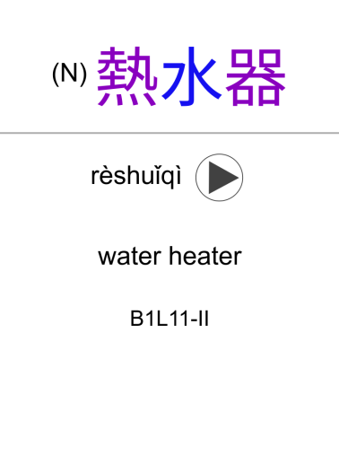

# CCC Anki deck

This is an Anki deck to review vocabulary from the textbook 當代中文課程 aka. A Course in Contemporary Chinese. It is based on the [data from Kevin Lang](https://github.com/kevinlang/ccc-flashcards).




## Features

* Contains all the vocabulary from book 1 to book 6 lesson 1
* Every card has audio [as pronunced by the authors of the book](http://mtc.ntnu.edu.tw/chinese-resource.htm)
* Proper Taiwanese-style characters rendering (using html lang tags)
* Colored Hanzi according to tones (generated at run time, so it works for any new card too)
  * You can change the colors by editing the card CSS and replacing the [color codes](https://en.wikipedia.org/wiki/Web_colors)
* Includes part of speech (noun, verb, measure word…) both displayed on cards and as tags
* Two types of cards:
  * hanzi+english → pinyin+audio
  * pinyin+english+audio → hanzi
* People and place names tagged
* Lesson numbers included as tags to easily search cards from a specific lesson or book:
  * Filter by tag `B1L5-I` to get the dialog (對話) from lesson 5, book 1
  * Filter by tag `B3L10-II` to get the text (短文) from lesson 10, book 3
  * Filter by tag `B3L1` to get all the lesson 1 from book 3
  * Filter by tag `B4` to get all the book 4
  * This way you can suspend or reschedule cards according to which lesson you start from

## How to compile

First install [genanki](https://github.com/kerrickstaley/genanki), and then run:
```
./build.sh output.apkg
```
It will download the audio, process it and generate the deck into a file `output.apkg`.

If you don't want the audio, just run:
```
./generate_deck.py output.apkg
```

## How to use

Either generate the deck using the instructions above or download the latest release, and then import the apkg file into Anki.
